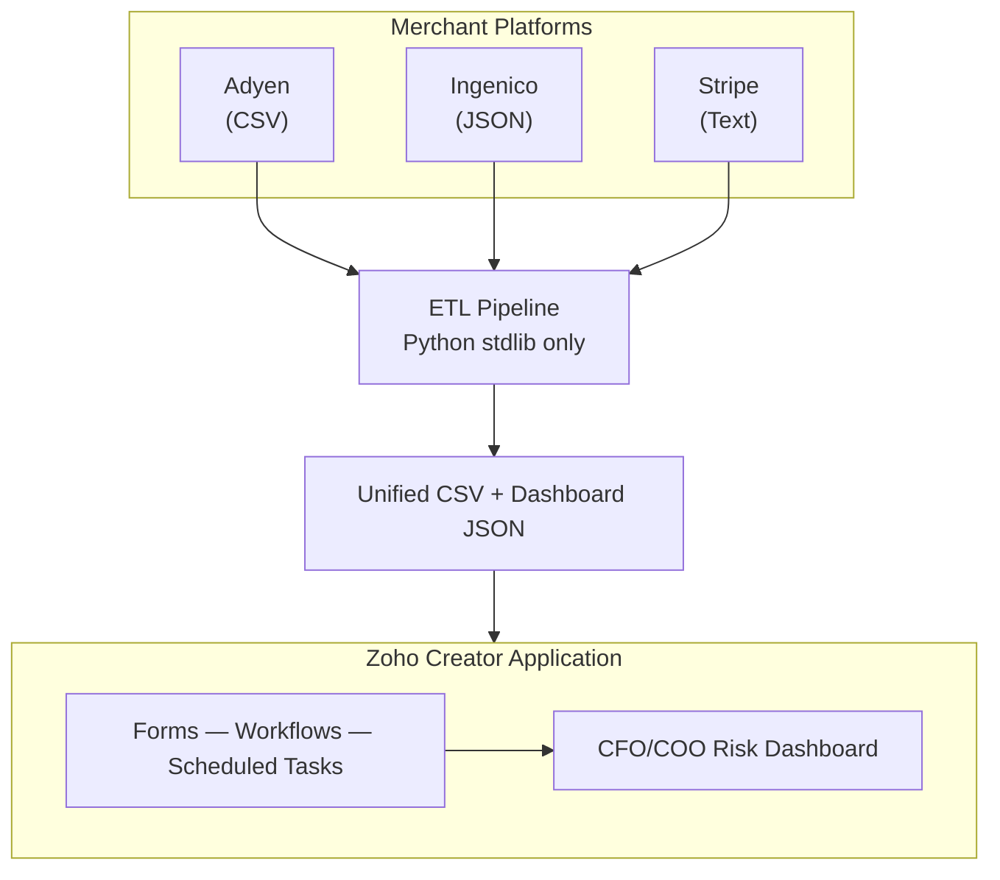
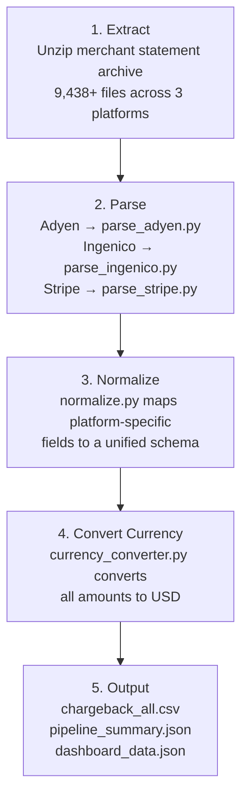
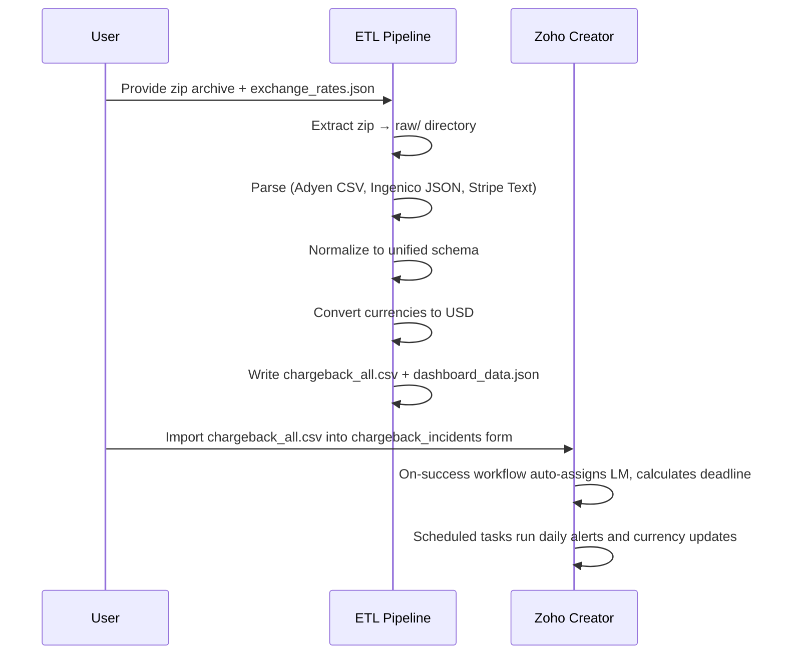

# Ten Chargeback Management

Zoho Creator application for managing chargebacks across multiple merchant platforms (Adyen, Ingenico, Stripe). Built with [ForgeDS](https://github.com/HolgerRGevers/ForgeDS).

<div align="center">

[](https://holgergevers-hub.github.io/Ten_Chargeback/src/dashboard/index.html)

**$303,247.67 USD** total exposure | **324** disputes | **3** platforms

[](https://github.com/holgergevers-hub/Ten_Chargeback/releases/download/v1.0.0/ten_chargeback_management.ds)

</div>

---

## Executive Summary

Ten Group's credit controllers process chargebacks from three merchant platforms, each with a different file format, field naming convention, and currency. There is no single view of total exposure and no automated alerting for the 30-day dispute window.

This project solves that. A Python ETL pipeline normalizes 9,438+ merchant statement files into a unified schema, converts all amounts to USD, and outputs clean data ready for import into a Zoho Creator application. The Creator app provides lifecycle management (forms, workflows, scheduled alerts) and an interactive CFO/COO dashboard showing total exposure, monthly trends, and regional breakdown.

The entire ETL pipeline runs on Python stdlib only — zero external dependencies.

---

## Contents

- [Overview](#overview)
- [Data Pipeline](#data-pipeline)
  - [How Import Chargebacks Works](#how-import-chargebacks-works)
  - [Currency Conversion](#currency-conversion)
  - [Future Improvement: Live Exchange Rates via API](#future-improvement-live-exchange-rates-via-api)
- [Deploy to Zoho Creator](#deploy-to-zoho-creator)
  - [Option A: Build Manually](#option-a-build-manually)
  - [Option B: Import the .ds File](#option-b-import-the-ds-file-forgeds)
- [Key Results](#key-results)
- [Technical Reference](#technical-reference)
  - [Platform Formats](#platform-formats)
  - [Project Structure](#project-structure)
  - [What's in the .ds File](#whats-in-the-ds-file)
- [Requirements](#requirements)
- [Accessibility and Tooltips](#accessibility-and-tooltips)
- [Built With](#built-with)

---

## Overview

Ten Group's credit controllers manage chargebacks across 3 merchant platforms in different formats. This project provides:

- **ETL Pipeline** — Extracts, normalizes, and converts 9,438+ merchant statement files into a unified schema with USD amounts
- **Zoho Creator App** — Forms, workflows, and scheduled tasks for chargeback lifecycle management
- **CFO/COO Dashboard** — Interactive risk dashboard showing total exposure, trends, and regional breakdown
- **Process Documentation** — Current state mapping, pain point analysis, and future state model

### Structure and Data Flow



---

## Data Pipeline

The ETL pipeline runs in five sequential steps. Each step feeds the next; there are no external service calls or dependencies.



Each parser handles the inconsistencies specific to its platform — auto-detecting delimiters, date formats, and field names. The normalizer maps every platform's fields to a single `UNIFIED_FIELDS` schema so downstream code never needs to know which platform a record came from.

### How Import Chargebacks Works

The chargeback import is a two-stage process: the ETL pipeline runs locally on your machine, then the output is uploaded into Zoho Creator.



**Running the pipeline:**

```bash
python -m src.etl.pipeline \
  --zip "path/to/Chargeback Records (2).zip" \
  --rates data/exchange_rates.json \
  --output data/clean/
```

This produces three files in `data/clean/`:

| File | Purpose |
|------|---------|
| `chargeback_all.csv` | All 324 records, unified schema, USD amounts — import this into Zoho |
| `pipeline_summary.json` | Aggregate statistics by platform, merchant, currency, region |
| `dashboard_data.json` | Pre-aggregated data powering the CFO/COO dashboard |

If any records cannot be converted (missing currency or rate), they appear in `chargeback_needs_review.csv` with a conversion status flag.

### Currency Conversion

All original amounts are converted to USD using rates from `data/exchange_rates.json`. The rates are USD-base: divide the original amount by the rate to get USD.

The pipeline processed four currencies across the dataset:

| Currency | Records | Conversion |
|----------|---------|------------|
| GBP | Majority | Amount / GBP rate → USD |
| EUR | Significant | Amount / EUR rate → USD |
| USD | Direct | No conversion needed |
| JPY | Small subset | Amount / JPY rate → USD |

322 of 324 records converted successfully. The 2 remaining records are flagged for manual review.

### Future Improvement: Live Exchange Rates via API

The current ETL pipeline uses a static `exchange_rates.json` file. A planned improvement replaces this with live API calls so conversion rates reflect the date of each transaction rather than a single snapshot.

**Inside Zoho Creator (already scaffolded):** The scheduled task `currency_conversion_batch.dg` calls the [Open Exchange Rates API](https://open.er-api.com/v6/latest/USD) daily to convert any records missing a USD amount. This runs at 03:00 and handles new imports or records where the original conversion failed. The Deluge script is already in [`src/deluge/scheduled/`](src/deluge/scheduled/currency_conversion_batch.dg).

**Outside Zoho (Python ETL):** The pipeline's `CurrencyConverter` class currently reads from a local JSON file. The next iteration will accept an `--api` flag that fetches rates from the same API at pipeline runtime, falling back to the local file if the API is unavailable. This keeps the zero-dependency principle intact — `urllib` is part of Python stdlib.

---

## Deploy to Zoho Creator

### Option A: Build Manually

This is the recommended approach. Full field definitions and form schemas are documented in [FORM_SCHEMA.md](src/deluge/setup/FORM_SCHEMA.md).

**Steps:**

1. Create the 6 forms in Zoho Creator following the schema definitions
2. Import the seed data (see table below)
3. Paste Deluge scripts from [`src/deluge/`](src/deluge/) into the corresponding workflows
4. Run the ETL pipeline and import `chargeback_all.csv` into the `chargeback_incidents` form

**Seed data:**

| Upload this file | Into this form | Records |
|-----------------|---------------|---------|
| [`regional_config.json`](config/seed-data/regional_config.json) | `regional_config` | 38 merchant accounts |
| [`dispute_reason_codes.json`](config/seed-data/dispute_reason_codes.json) | `dispute_reason_codes` | 13 reason codes |
| [`merchant_platforms.json`](config/seed-data/merchant_platforms.json) | `merchant_platforms` | 3 platforms |
| [`currency_config.json`](config/seed-data/currency_config.json) | `currency_config` | 11 currencies |

**Deluge scripts to configure:**

| Script | Location | Trigger |
|--------|----------|---------|
| `chargeback_incident.on_success.dg` | Form workflow | On record create |
| `dispute_submission.on_success.dg` | Form workflow | On record create |
| `auto_alert_25_days.dg` | Scheduled | Daily at 06:00 |
| `daily_file_processing.dg` | Scheduled | Daily at 02:00 |
| `currency_conversion_batch.dg` | Scheduled | Daily at 03:00 |
| `data_cleansing_scheduled.dg` | Scheduled | Daily at 04:00 |
| `get_dashboard_summary.dg` | Custom API | On request |
| `get_aging_report.dg` | Custom API | On request |
| `install_app.dg` | Setup | Run once after form creation |

> **How to import data:** Open the form > **Import Data** (top-right) > upload CSV/JSON > map columns > Import.

<div align="center">

[](src/deluge/setup/FORM_SCHEMA.md)

</div>

### Option B: Import the .ds File ([ForgeDS](https://github.com/HolgerRGevers/ForgeDS))

> **Status: Under construction.** The `.ds` file import method is being developed as part of the [ForgeDS](https://github.com/HolgerRGevers/ForgeDS) project. ForgeDS generates Zoho Creator application definition files (`.ds`) from configuration, enabling one-click deployment. This option will replace the manual build process once complete.

<div align="center">

[](https://github.com/HolgerRGevers/ForgeDS)

</div>

1. Download [**ten_chargeback_management.ds**](https://github.com/holgergevers-hub/Ten_Chargeback/releases/download/v1.0.0/ten_chargeback_management.ds)
2. In Zoho Creator: **Settings > Import Application > Upload .ds file**
3. Import seed data (same table as Option A)
4. Run the ETL pipeline and import chargebacks

---

## Key Results

- **Total Chargeback Exposure: $303,247.67 USD**
- 324 records across 3 platforms
- 322/324 records successfully converted to USD
- Currencies processed: GBP, EUR, USD, JPY

---

## Technical Reference

This section provides additional detail for technical evaluation.

### Platform Formats

The ETL pipeline handles 3 different merchant platform formats. Column names are inconsistent across merchant accounts within the same platform. The pipeline auto-detects delimiters, date formats, and field names.

| Platform | Format | Delimiter | Date Format | Amount Field |
|----------|--------|-----------|-------------|-------------|
| Adyen | CSV | Comma | Mixed (YYYY-MM-DD, MM/DD/YYYY) | Varies |
| Ingenico | JSON | N/A | DD-MM-YYYY | Varies |
| Stripe | Text | Pipe or Tab | YYYY-MM-DD | Varies |

Each parser (`parse_adyen.py`, `parse_ingenico.py`, `parse_stripe.py`) handles its platform's idiosyncrasies independently. The normalizer then maps all parsed output to a single unified schema defined in `normalize.py`.

### Project Structure

```
config/               ForgeDS configuration, seed data, email templates
src/etl/              Python ETL pipeline (stdlib only, zero dependencies)
  extract.py          Zip extraction and file discovery
  parse_adyen.py      Adyen CSV parser (auto-detects delimiters and date formats)
  parse_ingenico.py   Ingenico JSON parser
  parse_stripe.py     Stripe text parser (pipe and tab delimited)
  normalize.py        Maps platform fields to unified schema
  currency_converter.py  USD conversion using exchange_rates.json
  field_mapping.py    Field name detection and mapping rules
  pipeline.py         Orchestrator — runs all 5 steps in sequence
src/deluge/           Zoho Creator Deluge scripts
  form-workflows/     On-success scripts for chargeback and dispute forms
  scheduled/          Daily scheduled tasks (alerts, file processing, currency, cleansing)
  custom-api/         REST endpoints for dashboard and aging reports
  setup/              Form schema definitions and install helper
src/dashboard/        Interactive HTML/JS dashboard (Chart.js, zero build step)
data/                 Exchange rates (committed), raw/ and clean/ (gitignored)
docs/                 Process documentation (current state, pain points, future state)
tests/                ETL unit tests
```

### What's in the .ds File

| Component | Count | Details |
|-----------|-------|---------|
| Forms | 10 | chargeback_incidents, dispute_submissions, audit_trail, regional_config, dispute_reason_codes, merchant_platforms, currency_config, lm_followups, merchant_responses, file_uploads |
| Reports | 8 | All Chargebacks, Open Chargebacks, Expiring Soon, All Disputes, Audit Log, + 3 config views |
| Deluge Scripts | 9 | 2 form workflows, 2 custom APIs, 4 scheduled tasks, 1 install helper |
| Schedules | 4 | 25-day alerts (06:00), file processing (02:00), currency conversion (03:00), data cleansing (04:00) |

---

## Requirements

- Python >= 3.10 (stdlib only, no external packages needed)
- [ForgeDS](https://github.com/HolgerRGevers/ForgeDS) (for linting and `.ds` file generation)

---

## Accessibility and Tooltips

Form field tooltips and accessibility configuration are documented in [FORM_SCHEMA.md](src/deluge/setup/FORM_SCHEMA.md). Each field includes display name, type, and usage notes to guide tooltip content when configuring forms in Zoho Creator.

---

## Skills Journey

This repository is **Phase 3** of a development journey that began with a
Zoho Creator assessment and grew into five repositories, a mathematical
framework, and a C runtime. See the
[full narrative](https://github.com/holgergevers-hub/Portfolio) for context.

---

## Built With

<div align="center">

[](https://github.com/HolgerRGevers/ForgeDS)
[](https://github.com/holgergevers-hub/Ten_Chargeback)
[](https://claude.ai/code)

</div>

| Tool | Purpose |
|------|---------|
| [**ForgeDS**](https://github.com/HolgerRGevers/ForgeDS) | Zoho Creator application engine — linting, `.ds` file generation, Deluge conventions |
| [**Claude Code**](https://claude.ai/code) | AI pair programming — ETL pipeline development, documentation, code review |
| **Python 3.10+** | ETL pipeline runtime (stdlib only, zero external dependencies) |
| [**Chart.js**](https://www.chartjs.org/) | CFO/COO dashboard visualizations (CDN, zero build step) |
| **Zoho Creator** | Target platform — forms, workflows, scheduled tasks, custom APIs |
